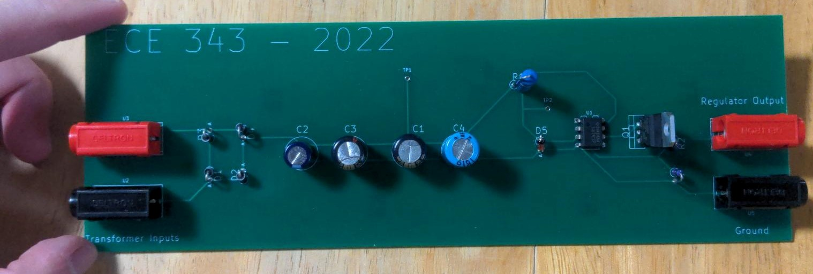
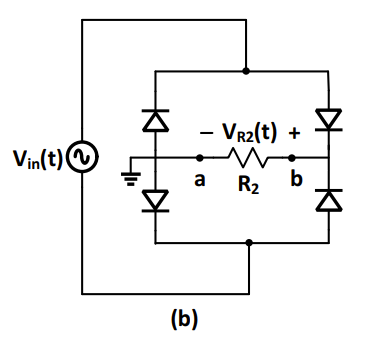
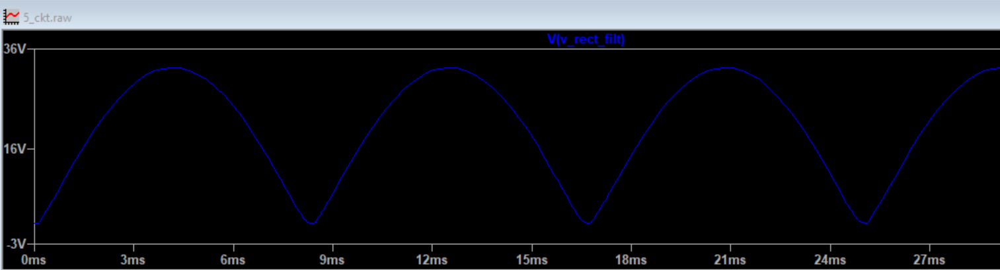
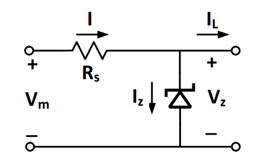
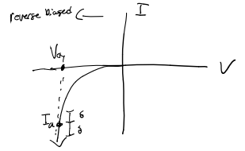
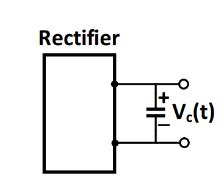
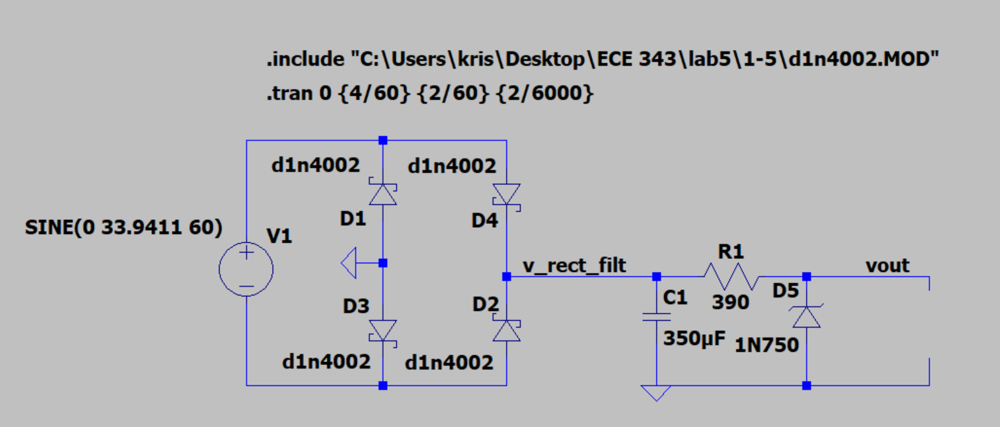
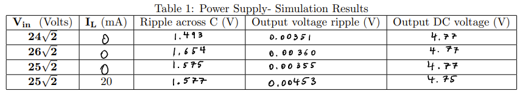

<!-- TABLE OF CONTENTS -->
## Table of Contents

* [About the Project](#about-the-project)
  * [Built With](#built-with)
* [Design](#design)
  * [Rectifier](#rectifier)
  * [Regulator](#regulator)
  * [Filter](#filter)
  * [Op-Amp](#op-amp)
  * [BJT](#bjt)
  * [Final Design](#final-design)
* [Acknowledgements](#acknowledgements)

<!-- ABOUT THE PROJECT -->
## About The Project

This is an AC-DC power supply with linear regulator. The specifications are:

1) DC open circuit output voltage = 9.5V-10V
2) Open circuit output voltage stays within 2% of the desired volatge as AC line voltage varies from 115 Vrms to 125 Vrms
3) Ripple voltage at output is less than 2% of open circuit output DC voltage
4) The output current can vary from 0 to 80 mA

### Built With

* Breadboard
* Resistors: 1x 390 Ohms, 2x 5,000 Ohms
* Diodes: 1x D1N750 (Zener Diode), 4x D1N 4002 (Rectifier Diodes)
* BJT: 2N3055
* OpAmp: LM741
* Capacitors: 1x 50 uF, 3x 100 uF

# Design

The next few sections will add on one part of the design, explaining why each part is needed and incrementally adding onto the circuit design.

### Rectifier

We use the full bridge rectifier to be able to fully utilize all signal power.
This gives us the wave shown:

### Regulator

We used a reversed biased zener diode to regulate the voltage. 
When using a zener diode, we know there is a threshold current I such that I +/- delta doesn't change the voltage very much.
We want to get the current Ia and Va to the operating point shown in the IV characteristics of the zener diode shown below

The max power rating of the diode is 500mW, so we set our max power to 375mW and used this to calculate the resistance we need for the circuit.
For an output voltage of 4.7V and 375mW, we need a resistance of 390 ohms.

### Filter

The filter is used to reduce the ripple from the rectifier output:

Vripple,out = 90mV, incremental resistance diode = 19 ohms, resistor = 390 ohms

Vripple,out = Vripple,c * (Rz / (Rz+Rs))

Vripple,c = Vripple,out * (Rz + Rs)/Rz

= 90mV * (19 + 390)/19 = 1.93 V

Vripple,c = I/(fC) -> C = I/(f\*Vripple,c) = 80/(120 * 1.93) = 345uF ~ 350uF

Design so far:

LTSpice simulation:

### Op-Amp

### BJT

### Final Design

<!-- ACKNOWLEDGEMENTS -->
## Acknowledgements
* [Readme Template](https://github.com/othneildrew/Best-README-Template)

