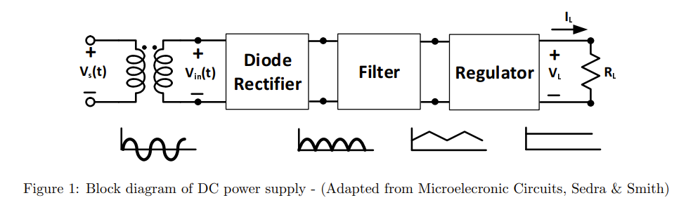

<!-- TABLE OF CONTENTS -->
## Table of Contents

* [About the Project](#about-the-project)
  * [Built With](#built-with)
* [Design](#design)
  * [Rectifier](#rectifier)
  * [Regulator](#regulator)
  * [Filter](#filter)
  * [Op-Amp](#op-amp)
  * [BJT](#bjt)
  * [Final Design](#final-design)
* [Acknowledgements](#acknowledgements)

<!-- ABOUT THE PROJECT -->
## About The Project

This is an AC-DC power supply with linear regulator. The specifications are:

1) DC open circuit output voltage = 9.5V-10V
2) Open circuit output voltage stays within 2% of the desired volatge as AC line voltage varies from 115 Vrms to 125 Vrms
3) Ripple voltage at output is less than 2% of open circuit output DC voltage
4) The output current can vary from 0 to 80 mA

### Built With

* Breadboard
* Resistors: 1x 390 Ohms, 2x 5,000 Ohms
* Diodes: 1x D1N750 (Zener Diode), 4x D1N 4002 (Rectifier Diodes)
* BJT: 2N3055
* OpAmp: LM741
* Capacitors: 1x 50 uF, 3x 100 uF

# Design

The next few sections will add on one part of the design, explaining why each part is needed and incrementally adding onto the circuit design.

## Rectifier

## Regulator

## Filter

## Op-Amp

## BJT

## Final Design

<!-- ACKNOWLEDGEMENTS -->
## Acknowledgements
* [Readme Template](https://github.com/othneildrew/Best-README-Template)

